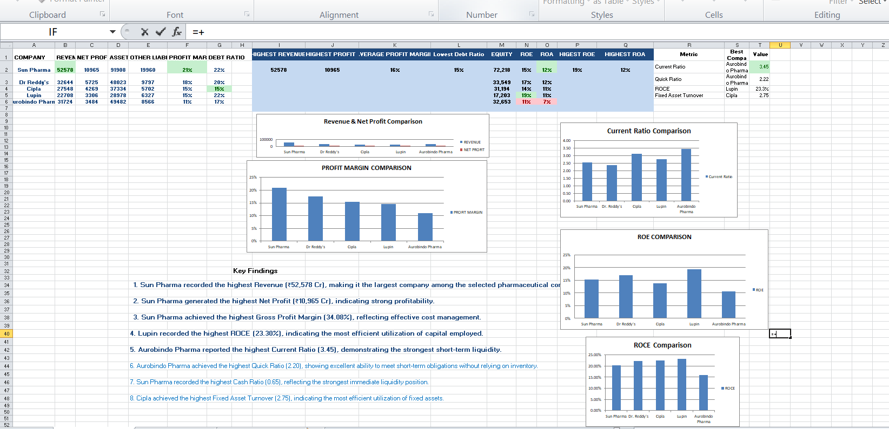
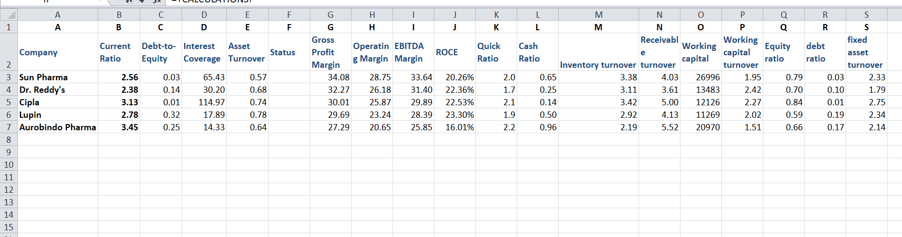

# 📊 Comparative Financial Analysis of Leading Indian Pharmaceutical Companies

## 📌 Project Overview

This project presents a comparative financial analysis of five leading Indian pharmaceutical companies using Microsoft Excel. The analysis includes financial statement data, key financial ratios, interactive dashboards, charts, and business insights to evaluate the financial performance of each company.

---

## 🏢 Companies Analyzed

- Sun Pharma
- Dr. Reddy's Laboratories
- Cipla
- Lupin
- Aurobindo Pharma

---

## 🛠️ Tools Used

- Microsoft Excel
- Financial Ratio Analysis
- Dashboard Design
- Data Visualization
- Conditional Formatting
- Excel Charts

---

## 📈 Financial Ratios Calculated

### Liquidity Ratios
- Current Ratio
- Quick Ratio
- Cash Ratio

### Profitability Ratios
- Gross Profit Margin
- Operating Margin
- EBITDA Margin
- ROE
- ROCE

### Solvency Ratios
- Debt-to-Equity Ratio
- Debt Ratio
- Interest Coverage Ratio

### Efficiency Ratios
- Asset Turnover
- Inventory Turnover
- Receivables Turnover
- Working Capital Turnover
- Fixed Asset Turnover

---

## 📊 Dashboard Features

- Revenue Comparison
- Net Profit Comparison
- Profit Margin Comparison
- Current Ratio Comparison
- ROE Comparison
- ROCE Comparison
- Financial Health Summary
- Key Business Insights

---

## 💡 Key Insights

- Sun Pharma recorded the highest revenue and net profit.
- Lupin achieved the highest ROCE.
- Aurobindo Pharma demonstrated the strongest liquidity position.
- Cipla showed the highest Fixed Asset Turnover.

---

## 🚀 Skills Demonstrated

- Financial Statement Analysis
- Financial Ratio Analysis
- Microsoft Excel
- Dashboard Development
- Business Analytics
- Data Visualization
- Analytical Thinking
## 📸 Project Screenshots

### Dashboard

### Financial Data

### Calculations

